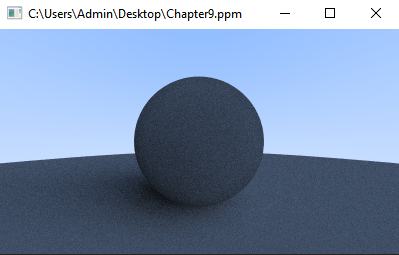

# ppm-viewer-cpp
Lightweight PPM (P3/P6) image viewer in C++ using SFML, built as a utility for ray tracing projects.

---

## Overview

This project is a lightweight utility for loading and displaying `.ppm` images. It was developed while working through *Ray Tracing in One Weekend*, where images are commonly exported in PPM format.

The purpose of this tool is to provide a simple way to visualize rendering output without relying on external image viewers.

---

## Features

* Supports P3 (ASCII) and P6 (binary) PPM formats
* Handles comment lines (`# ...`) and flexible whitespace
* Automatically scales color values based on `max_color`
* Converts raw pixel data into GPU-ready textures for rendering using SFML
* Accepts file paths via command line arguments or standard input

---

## Limitations

* Assumes standard 8-bit output after scaling
* Minimal validation for malformed files
* Designed as a lightweight utility rather than a full-featured image viewer

---

## Usage

### Windows (Drag & Drop)

After building the project, you can drag and drop a `.ppm` file onto the executable to open it. The file path will be passed automatically as a command line argument.

### Run from terminal

```bash
./ppm_viewer path/to/image.ppm
```

### Run without arguments

```bash
./ppm_viewer
```

You will be prompted to enter the file path manually.

---

## Screenshots

Example:



---

## Build

### Requirements

* C++17 or newer
* SFML (version 3)

### Build steps

```bash
mkdir build
cd build
cmake ..
cmake --build .
```

---

## Project Structure

```
.
├── CMakeLists.txt  
├── README.md  
├── src/  
│   ├── main.cpp   
│   ├── PPMImage.h   
│   ├── read_file.h   
│   └── window.h   
├── test_images/   
│   └── exampleP3.ppm   
│   └── exampleP6.ppm   
└── screenshots/   
    └── Chapter9.png   
```

---

## Purpose

This project serves as:

* a simple standalone utility for viewing PPM images
* a learning exercise in file parsing and binary data handling
* a companion tool for ray tracing workflows

---

## Future Improvements

* Additional validation for malformed files
* Support for other Netpbm formats (PGM, PBM)
* Basic image controls (zoom, scaling)
* Live reload for iterative rendering

---

## License

MIT License
